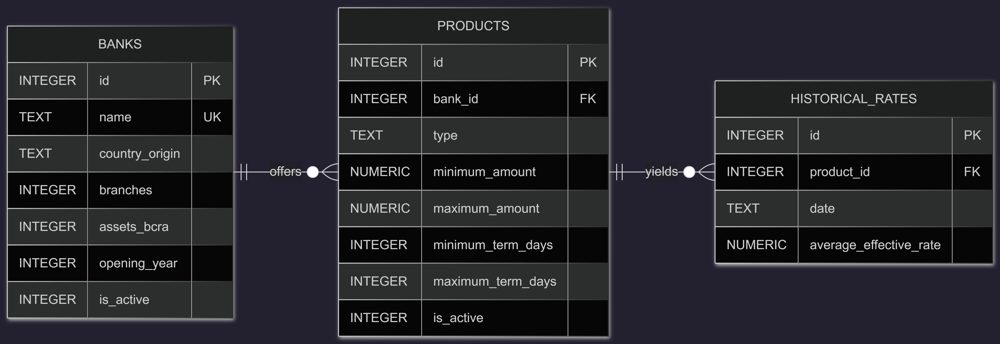

# Design Document

## Bank Interest Analysis System    

By Matías Nicolas Pacho

Video overview: <URL HERE>

## Scope

The main purpose of this database is, firstly:

1. To store and classify a select group of banks in Argentina and their financial products for savings and investment.

2. To provide users with a way to easily determine which alternatives offer the best or least expense for taking out a loan or which is the most profitable way to invest their savings.
> This makes sense in the context of Argentina, where interest rates can vary significantly from bank to bank and can experience substantial volatility in a short period. I also believe it can align the content of this course with my main area of ​​study, which is economics.

The dimensions of this database can be summarized as follows:
* Banks, which includes the main commercial banks in Argentina and their relevant data: name, country of origin, number of branches in the country, the amount of assets it owns (bank selection criteria), its opening year and the status of the bank, that could be 1 to active or 0 to inactive.
* Products, which includes the type of product (credit or savings), its terms and minimum, maximum amounts for each transaction and the status of the product, that could be 1 to active or 0 to inactive.
* Historical Rates, which records the monthly Average Effective Rate associated with each financial product allowing the database to track evolution of interest rates over time.

>Outside the model remain banks that have not been selected either because their size does not meet the imposed criteria or because they do not operate in the country, or financial services that do not meet the savings or loan category, or services that operate with an interest that is not equivalent or convertible to an effective interest rate.

## Functional Requirements

* What should a user be able to do with your database?
A user will be able to determine and compare which bank offers the most profitable interest rate for saving or taking out a loan, determine which bank offers the most branches in the country, calculate and analyze the financial spread of each bank (the difference between active loan rates and passive savings rates) to determine their intermediation margin.

* What's beyond the scope of what a user should be able to do with your database?
The following features will be unavailable to the user: comparisons between banks in Argentina and other countries, or the ability to view variations over periods shorter than one month. It will also not be possible to check the exact location of each branch within the country.

## Representation

### Entities

#### Banks

The `banks` table includes:
* `id`, this column contains the unique id for each bank as an `INTEGER`. Also this column has the `PRIMARY KEY` constraint applied. 
* `name`, this column will contain the name of each bank, therefore the chosen type is `TEXT`. Since this field cannot be empty, the `NOT NULL` constraint is applied, and `UNIQUE` is used to prevent repetitions.
* `country_origin`, this column will contain the name of the bank's country of origin, which can be Argentina itself or any other country, the type used is `TEXT`.
* `branches`, contains the number of branches each bank has in the country. Since there cannot be half a branch, the data type used is `INTEGER`. A `CHECK` constraint is also applied to verify that the number of branches is at least 0 (0 in the case of a digital bank without physical branches for example).
* `assets_bcra`, it contains the value in pesos of the assets of the bank in question provided by the central bank of Argentina, the BCRA; it is the selection criterion of the main banks. Since we are talking about orders of magnitude of billions of pesos, the decimal value loses importance; the type used is `INTEGER`.
* `opening_year`, the year in which the reference bank was founded or began operating; since only the year is required, the selected type is `INTEGER`. A constraint `CHECK` is applied to verify that no dates prior to 1810 (Argentina's independence) are entered.
* `is_active`, this column is part of the soft deletion system; it can only take two values: By default, it is 1 to indicate that the bank or product is active, and it is updated to 0 when the `soft_delete_bank_products` trigger is activated to indicate that the bank or product becomes inactive. It is defined as an `INTEGER` and with a `CHECK` constraint to verify that it only assumes the values ​​of 0 or 1.

#### Products

The `products` table includes:
* `id`, this column contains the unique id for each product as an `INTEGER`. Also this column has the `PRIMARY KEY` constraint applied. 
* `bank_id`, this column refers the id of each bank in the 'banks' table. This column has the `FOREIGN KEY` constraint applied.
* `type`, this column classifies the type of financial product as either a savings or loan product. It is of type `TEXT`. It is also worth mentioning that, as loans and deposits are unified into two categories, personal loans and savings accounts, the restraint `CHECK` was applied to these two categories.
* `minimum_amount`, this column will contain the minimum monetary values ​​required to access each service, whether it's a loan or a minimum investment deposit. Since we're dealing with monetary values, which may include cents, the chosen type is `NUMERIC`. It can contain null values.
* `maximum_amount`, this column will contain the maximum monetary values allowed to access each service, whether it's a loan or a minimum investment deposit. Since we're dealing with monetary values, which may include cents, the chosen type is `NUMERIC`. It can contain null values.
* `minimum_term_days`, This column will contain the minimum holding period in days for an investment before it can be withdrawn, or the minimum loan repayment period in days. Its data type is `INTEGER`. It can contain null values.
* `maximum_term_days`, This column will contain the maximum holding period in days for an investment before it can be withdrawn, or the maximum loan repayment period in days. Its data type is `INTEGER`. It can contain null values.
* `is_active`, this column is part of the soft deletion system; it can only take two values: By default, it is 1 to indicate that the bank or product is active, and it is updated to 0 when the `soft_delete_bank_products` trigger is activated to indicate that the bank or product becomes inactive. It is defined as an `INTEGER` and with a `CHECK` constraint to verify that it only assumes the values ​​of 0 or 1.

#### Historical_Rates

The `historical_rates` table includes:
* `id`, this column contains the unique id for each rate as an `INTEGER`. Also this column has the `PRIMARY KEY` constraint applied. 
* `product_id`, this column refers the id of each product in the 'products' table. This column has the `FOREIGN KEY` constraint applied.
* `date`, the date (YYYY-MM) on which the interest rate value for the reference product is recorded. The used type is `TEXT`, since there is no type for dates with this format in SQLite.
* `average_effective_rate`, the average effective interest rate, since this type of rate usually has values ​​with a decimal point, the `NUMERIC` type is chosen.

### Relationships

Below is the ERD diagram that describes the relationships between the tables and entities in the database:

As detailed by the diagram:

* A bank is capable of offering 0 to many financial products: 0 if the bank has just been registered in the database and has not yet launched any services, and many if it offers several types of loans and savings accounts. Conversely, a product is offered by one and only one bank.
* A financial product can yield 0 to many historical rates: 0 if it is a newly created product with no monthly interest rate records yet, and many as time passes and the average effective rates (TEA) are logged month by month. A historical rate record is associated with one and only one financial product.

## Optimizations

### Triggers
To implement the soft deletion system, the trigger `soft_delete_bank_products` is created:

* `soft_delete_bank_products`, this trigger is designed to automate the logical deletion (soft delete) process and maintain data integrity. When a bank's `is_active` status is updated from `1` (active) to `0` (inactive), the trigger automatically cascades this change, setting the `is_active` status of all financial products associated with that bank to `0`. This ensures that products from inactive banks are immediately removed from current market views, while safely preserving all historical rate data for accurate retroactive analysis without triggering foreign key conflicts.

### Views
To simplify the user experience and abstract complex SQL logic, three views were created:

* `bank_spread_analysis`, calculates the financial spread (the difference between loan rates and savings rates, or which is the same active and passive interest rates) for each bank in the last recorded month. To achieve this without compromising the database's normal forms, it utilizes Common Table Expressions (CTEs) to temporarily separate active rates from passive rates and then joins them together. It only considers active banks and products for its analysis.
* `lowest_loan_rates`, this view filters the rates strictly for `personal_loan` products in the last recorded month and pre-sorts the results in ascending order. It allows a user seeking credit to instantly query the cheapest available options across all banks using a simple `SELECT` statement. It only considers active banks and products for its analysis.
* `highest_deposit_rates`, similar to the previous view, this isolates `savings_account` products in the last recorded month and pre-sorts the rates in descending order, offering a ready-to-use ranking for investors looking to maximize their yield. It only considers active banks and products for its analysis.

### Indexes
* idx_products_bank_id and idx_rates_product_id, these indexes were created on the `FOREIGN KEY` columns. Since the core analytical views constantly require joining the `banks`, `products`, and `historical_rates` tables, these indexes drastically reduce the time needed to match records across tables.
* idx_products_type, this index was placed on the `type` column within the `products` table. It prevents full table scans when the views filter data using the `WHERE type = 'personal_loan'` or `WHERE type = 'savings_account'` clauses.
* idx_rates_value, this index is applied to the `average_effective_rate` column in the `historical_rates` table. Since ordering mathematical values is a resource-intensive operation, this index maintains a pre-sorted B-Tree of the rates, significantly accelerating the `ORDER BY` execution in the ranking views.

## Limitations

The current database design provides a foundation for analyzing historical interest rates among major Argentine banks, but it does have certain limitations:

* SQLite Type Constraints: Because SQLite lacks strict `ENUM` and native `DATE` storage classes, the database relies on `TEXT` with `CHECK` constraints to enforce data integrity (e.g., limiting product types and strictly formatting dates as 'YYYY-MM'). While this workaround is effective, it is less rigid than native data types found in heavier database engines like PostgreSQL or MySQL.
* Temporal Resolution: The database is structured to capture monthly snapshots of the average effective rates (TEA). In a highly volatile macroeconomic environment where interest rates and monetary policies can change drastically within weeks, this design cannot track intra-month volatility or daily rate adjustments.
* Complexity: The schema unifies loans and deposits into a single `products` table. While this elegantly handles standard retail banking products, it would struggle to accurately represent highly complex or variable-yield financial instruments (such as mutual funds, sovereign bonds, or foreign exchange derivatives) without requiring a structural redesign or additional tables.
* Lack of Transactional Information: The model is an analytical tool focused on macro-level bank offerings. It does not track individual customer portfolios, credit scores, or user-level transaction histories.
